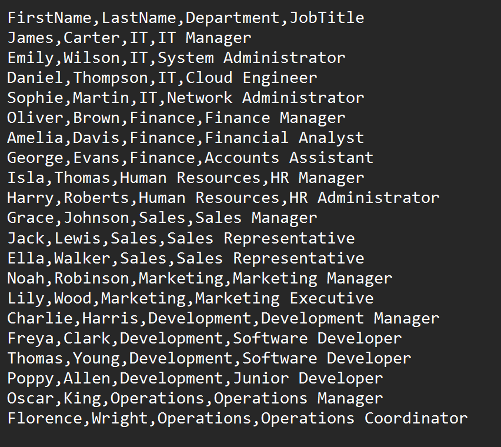

# Implementation

# 1. Tenant Configuration

# 2. User Management
## 2.1. Objective 
The objective of this stage was to create a set of fictional users within Microsoft Entra ID that could be later organised into security groups and used to demonstrate identity and access management. This was completed using PowerShell and Microsoft Graph rather than manually creating each user individually.

## 2.2. User structure 
For this project I created 20 users which were split across 7 different departments. Each user was given a unique job title relating to the department they were assigned to. The users were distributed across multiple departments to provide a realistic environment for testing group based access control. 

## 2.3. CSV User data 
For the CSV file I created 4 columns; FirstName, LastName, Department and JobTitle. The CSV files acts as the input dataset for the provisioning script. Other values such as the User Principal Name and Display Name were generated automatically by the PowerShell script. 

## 2.4. PowerShell Implementation
The final PowerShell script was developed incrementally. I initially created the script to create a single user. Once I had a single user created I extended the script to create all 20 users by using a foreach loop.

The CSV data was imported using the Import-CSV cmdlet. The script then processed each user and used Microsoft Graph to create the corresponding account within Microsoft Entra ID.

For each record, the script:
(1) Reads the user's first name, last name, department and job title 
(2) Generates the user's display name 
(3) Generates a User Principal Name using the users name and verified tenant domain 
(4) Checks if the user already exists 
(5) Creates the user in Microsoft Entra ID
(6) Assigns the department and job title attributes 
(7) Enables the account and then assigns a temporary password 

The complete script is here:  

The script is heavily commented to explain the purpose of each section.

## 2.5. Evidence 
Figure 1 - User provisioning CSV dataset 

Figure 2 - Verification of 20 users imported from CSV

Figure 3 - PowerShell showing users created 

Figure 4 - Example Entra ID user and attributes 

# 3. Group Management

# 4. Role-Based Access Control

# 5. Authentication

# 6. Conditional Access

# 7. Enterprise Applications

# 8. Monitoring
