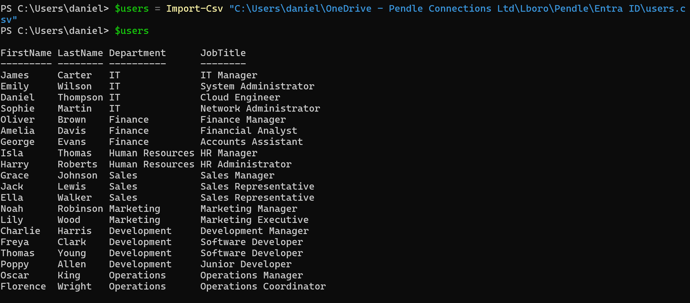
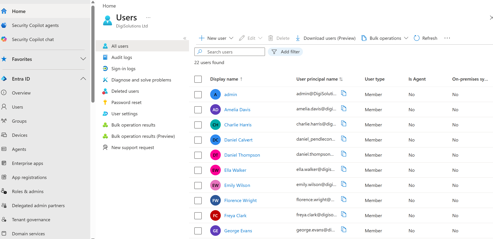

# Implementation

# 1. Tenant Configuration

# 2. User Management
## 2.1. Objective 
The objective of this stage was to create a set of fictional users within Microsoft Entra ID that could be later organised into security groups and used to demonstrate identity and access management. This was completed using PowerShell and Microsoft Graph rather than manually creating each user individually.

## 2.2. User structure 
For this project I created 20 users which were split across 7 different departments. Each user was given a unique job title relating to the department they were assigned to. The users were distributed across multiple departments to provide a realistic environment for testing group based access control. 

## 2.3. CSV User data 
For the CSV file I created 4 columns; FirstName, LastName, Department and JobTitle. The CSV files acts as the input dataset for the provisioning script. Other values such as the User Principal Name and Display Name were generated automatically by the PowerShell script. 

## 2.4. PowerShell Implementation
The final PowerShell script was developed incrementally. I initially created the script to create a single user. Once I had a single user created I extended the script to create all 20 users by using a foreach loop.

The CSV data was imported using the Import-CSV cmdlet. The script then processed each user and used Microsoft Graph to create the corresponding account within Microsoft Entra ID.

For each record, the script:
(1) Reads the user's first name, last name, department and job title 
(2) Generates the user's display name 
(3) Generates a User Principal Name using the users name and verified tenant domain 
(4) Checks if the user already exists 
(5) Creates the user in Microsoft Entra ID
(6) Assigns the department and job title attributes 
(7) Enables the account and then assigns a temporary password 

The complete script is here: [View the Create-EntraUsers.ps1 script](../scripts/Create-EntraUsers.ps1)

## 2.5. Evidence 
Figure 1 - User provisioning CSV dataset 

Figure 2 - Verification of 20 users imported from CSV

Figure 3 - Example Entra ID user and attributes 

# 3. Group Management
## 3.1. Objective
The objective of this stage was to organise the users just created into groups based on the department they are assigned to. For this project, eight security groups were created, with an additional group for managers.

I also created two additional administrative groups: IT-Admins and Security-Admins. These groups will be used to demonstrate RBAC, as outlined in the next section. As 'James Carter' is IT Manager he has been assigned to IT-Admins group alongside 'Sarah Mitchell', while 'Emily Wilson' has been assigned to Security-Admins.

## 3.2. Group structure 
The following security groups were created: IT-Users, Finance-Users, HR-Users, Sales-Users, Marketing-Users, Development-Users, Operations-Users and Managers. 

## 3.3. Group creation 
The security groups were created as Microsoft Entra security groups rather than Microsoft 365 groups. Security groups were selected as the main purpose of this lab is to manage identity and access rather than provide collaboration features. 

The complete script for creating groups is here: [View the Create-EntraGroups.ps1 script](../scripts/Create-EntraGroups.ps1)

To demonstrate the different approaches to Entra ID administration, the administrative groups (IT-Admins and Security-Admins) were created manually through the Microsoft Entra admin centre rather than through PowerShell. 

## 3.4. PowerShell implementation for assigning users to groups 
The group membership process was automated using the Microsoft Graph PowerShell SDK. 

For each user in the CSV, the script:
(1) Reads the department the user is part of 
(2) Uses the hashtable (described below) to determine the security group name 
(3) Finds the corresponding group in Microsoft Entra ID
(4) Finds the corresponding user using their User Principal Name 
(5) Gets the existing members of the department group
(6) Checks whether the user is already a member 
(7) Adds the user to the group if not 

The PowerShell script uses a hashtable to map the department valuers in the csv file to the corresponding security group names in Microsoft Entra ID. This approach was used as the department name does not always directly match the group name e.g. for HR group. 

The complete script for assigning the users to groups is here: [View the Assign-UsersToGroups.ps1 script](../scripts/Assign-UsersToGroups.ps1)

# 4. Role-Based Access Control

# 5. Authentication

# 6. Conditional Access

# 7. Enterprise Applications

# 8. Monitoring
